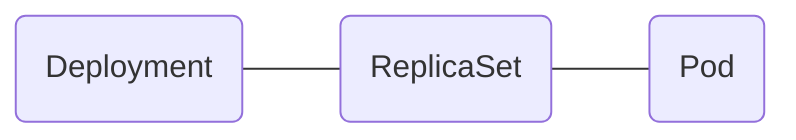

## K8S-Deployment

### 1.控制器模型

1. Deployment 控制器从 Etcd 中获取到所有携带了“ selector.matchLabels”标签的 Pod，然后统计它们的数量，这就是实际状态；
2. Deployment 对象的 Replicas 字段的值就是期望状态；
3.  Deployment 控制器将两个状态做比较，然后根据比较结果，确定是创建 Pod，还是删除已有的 Pod 

### 2. Replicas期望状态的实现（ ReplicaSet ）

Deployment、ReplicaSet 、Pod的关系：

三者间是 一种“层层控制”的关系。 ReplicaSet 负责通过“控制器模式”，保证系统中 Pod 的个数永远等于指定的个数。 Deployment 只允许容器的 restartPolicy=Always 的主要原因：只有在容器能保证自己始终是 Running 状态的前提下，ReplicaSet 调整 Pod 的个数才有意义。  Deployment 同样通过“控制器模式”，来操作 ReplicaSet 的个数和属性，进而实现“水平扩展 / 收缩”和“滚动更新”这两个编排动作。 

**Deployment 控制 ReplicaSet（版本），ReplicaSet 控制 Pod（副本数）** 

### 3. Deployment滚动更新过程

1.  Deployment Controller  创建一个 Pod 副本个数为 N 的 ReplicaSet（名字为 Deployment 名+ 一个随机字符串 ）
2.  ReplicaSet 会把这个随机字符串加在它所控制的所有 Pod 的标签里，从而保证这些 Pod 不会与集群里的其他 Pod 混淆。 
3.  修改了 Deployment 的 Pod 模板，“滚动更新”就会被自动触发。
4.  Deployment Controller 会使用这个修改后的 Pod 模板，创建一个新的 ReplicaSet 。 这个新的 ReplicaSet 的初始 Pod 副本数是：0。 
5.  然后新ReplicaSet 所控制的Pod 副本数+1，旧ReplicaSet 所控制的Pod 副本数-1， 如此交替进行，直到新的 ReplicaSet 的初始 Pod 副本数为N，旧的ReplicaSet 所控制的Pod 副本数为0， 就完成了这一组 Pod 的版本升级过程。 

###  kubectl   deployments  指令

-  **kubectl get deployments：**

   **DESIRED:**  用户期望的 Pod 副本个数（spec.replicas 的值） ;

   **CURRENT：**当前处于 Running 状态的 Pod 的个数；

   **UP-TO-DATE：**当前处于最新版本的 Pod 的个数，所谓最新版本指的是 Pod 的 Spec 部分与 Deployment 里 Pod 模板里定义的完全一致；

  **AVAILABLE：**当前已经可用的 Pod 的个数，即：既是 Running 状态，又是最新版本，并且已经处于 Ready（健康检查正确）状态的 Pod 的个数。