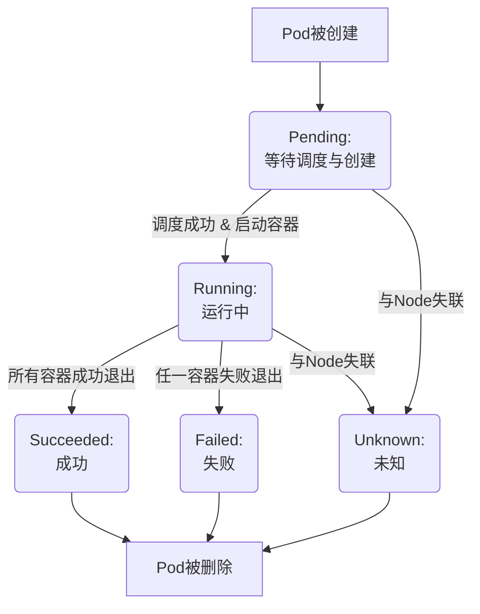
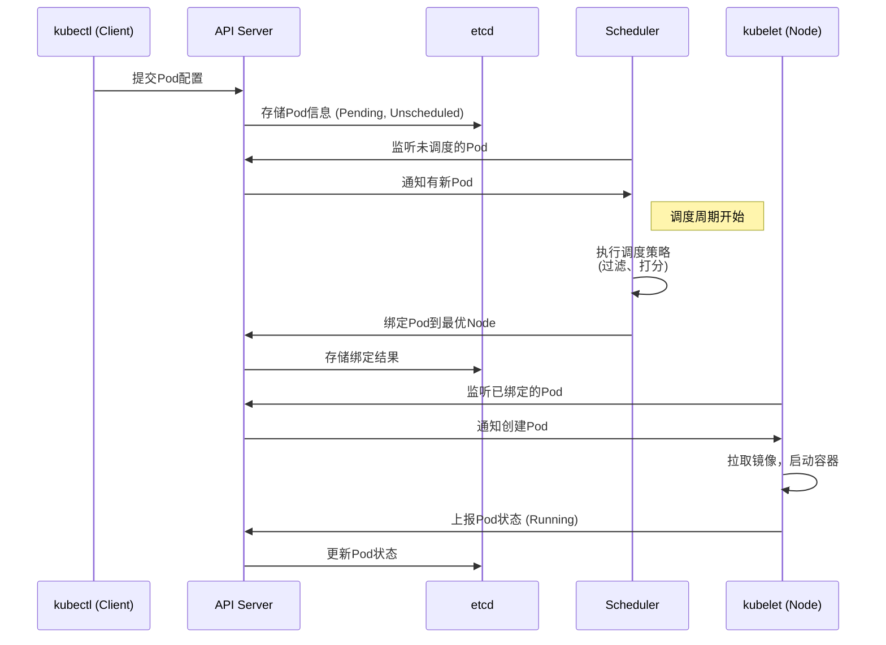

# K8S中POD的生命周期及其调度策略

---

## Part 1 - 什么是Pod？ ―― K8S世界中的“集装箱”

- **内容**：
    - **定义**：Pod是Kubernetes中最小的可部署和管理的计算单元。
    - **通俗比喻**：就像一个**物流集装箱**。
        - **集装箱本身** = Pod（提供运行环境、共享网络/IP/存储空间）
        - **箱内货物** = 一个或多个紧密关联的容器（例如：Web应用容器 + 日志收集Sidecar容器）
    - **核心特点**：
        1.  **原子性**：部署、扩展、消亡的最小单位。
        2.  **共享性**：Pod内容器共享Network、UTS、IPC命名空间。
        3.  **短暂性**：设计为“ ephemeral ”（短暂的），一旦被销毁，无法复活。

### 为什么需要Pod？

   * **管理紧密耦合的进程**： 有些应用需要多个辅助进程（如：日志收集、数据同步、代理）与主进程协同工作。Pod将它们作为一个整体来管理（同生共死，一起调度）。
   * **简化通信和共享**： 同一个Pod内的容器通过localhost直接通信，极大地简化了应用架构。它们可以方便地共享磁盘上的文件。
   * **解耦与复用**: 将“如何运行”（Pod/容器）与“运行什么”（Deployment/Service）分离开，使得应用编排更加灵活和可复用。

---

## Part 2 - Pod的生命周期 ―― 一场状态流转的旅程

Pod的生命周期不是线性的，而是一系列状态的集合。

| **状态**       | **说明**                              |
|----------------|-------------------------------------|
| **Pending**    | K8S已接受Pod定义，但还在“准备物资”（下载镜像、分配资源、调度） |
| **Running**    | Pod 已绑定到节点，所有容器已创建，至少有一个容器在运行。      |
| **Succeeded**  | 所有容器成功执行并退出（例如：一次性任务完成）。 常见于批处理任务。  |
| **Failed**     | 至少有一个容器异常退出（非 0 状态码）。               |
| **Unknown**    | 无法获取 Pod 状态（通常因节点失联导致）。             |


---

### 生命周期中的关键角色 - Init Container & Probe

- **内容**：
    - **Init Containers（初始化容器）**：
        - **做什么**：在应用容器（main container）启动前运行的专用容器，用于完成**准备工作**（如等待数据库就绪、下载配置文件、迁移数据库）。
        - **特点**：它们必须**按顺序成功运行完毕**，否则Pod会启动失败。
    - **Probes（探针）**：
        - **Liveness Probe（存活探针）**：检查容器**是否还活着**。如果检查失败，kubelet会**重启容器**。解决“进程存在但服务已死锁”的问题。
        - **Readiness Probe（就绪探针）**：检查容器**是否准备好接收流量**。如果检查失败，会从Service的负载均衡中**移除该Pod**。

---

## Part 3 - Pod的创建与调度流程――kube-scheduler的智能决策

- **内容**：
    - 当我们执行 `kubectl apply -f pod.yaml` 后，发生了什么？
    - **流程步骤**：
        1.  **提交**：`kubectl` 将Pod配置提交给 **API Server**。
        2.  **存储**：API Server 将其写入**etcd**数据库，标记为未调度。
        3.  **发现**：**Scheduler** 持续监听API Server，发现了这个未调度的Pod。
        4.  **过滤 & 打分**：Scheduler执行**调度策略**（下一Part详述），选出最合适的Node。
        5.  **绑定**：Scheduler将决策结果（Pod->Node绑定信息）通知API Server，API Server再写入etcd。
        6.  **创建**：目标Node上的 **kubelet** 监听到这个绑定关系，调用容器运行时（Docker/Containerd）**创建并启动容器**。
        7.  **反馈**：kubelet将Pod状态报告给API Server，最终更新到etcd。


- **配图**：使用HTML流程图展示整个过程。



- **备注**：强调Scheduler是一个独立的、决策性的组件，它只做决定，不负责执行。

---

## Part 4 - 核心调度策略――如何选出“意中Node”？

- **内容**：
    - Scheduler的决策是一个两阶段过程：
        1.  **Predicates（预选策略 / 过滤）**：排除所有不满足条件的Node。
            - **例子**：
                - `PodFitsResources`：Node的CPU、内存资源是否足够？
                - `PodFitsHostPorts`：Node上Pod要求的端口是否被占用？
                - `MatchNodeSelector`：Node的标签是否匹配`nodeSelector`？
                - ...（还有很多检查项）
        2.  **Priorities（优选策略 / 打分）**：对通过预选的Node进行打分（0-100），得分最高者获胜。
            - **例子**：
                - `LeastRequested`：选择**资源请求率最低**的Node（倾向于负载更轻的Node）。
                - `BalancedResourceAllocation`：选择CPU和内存资源使用率**更平衡**的Node。
                - `ImageLocality`：选择**已存在所需镜像**的Node（减少下载时间）。


- **备注**：Predicates是硬性条件，一票否决。Priorities是软性偏好，优中选优。

---

## Part 5 - 高级调度技巧――更精细的控制

### 节点选择器 (nodeSelector)

NodeSelector用于将pod调度到添加了指定标签的node节点上。它是通过kubernetes的label-selector机制实现的，也就是说，在pod创建之前，
会由scheduler使用MatchNodeSelector调度策略进行label匹配，找出目标node，然后将pod调度到目标节点，该匹配规则是强制约束。


### 亲和性调度

Affinity主要分为三类：

* nodeAffinity（node亲和性）: 以node为目标，解决pod可以调度到哪些node的问题
* podAffinity（pod亲和性） : 以pod为目标，解决pod可以和哪些已存在的pod部署在同一个拓扑域中的问题
* podAntiAffinity（pod反亲和性） : 以pod为目标，解决pod不能和哪些已存在pod部署在同一个拓扑域中的问题

关于亲和性(反亲和性)使用场景的说明：

* 亲和性：如果两个应用频繁交互，那就有必要利用亲和性让两个应用的尽可能的靠近，这样可以减少因网络通信而带来的性能损耗。
* 反亲和性：当应用的采用多副本部署时，有必要采用反亲和性让各个应用实例打散分布在各个node上，这样可以提高服务的高可用性。

### 污点和容忍度 (Taints and Tolerations)

#### Taint（污点）

Node被设置上污点之后就和Pod之间存在了一种相斥的关系，进而拒绝Pod调度进来，甚至可以将已经存在的Pod驱逐出去。

污点的格式为：key=value:effect, key和value是污点的标签，effect描述污点的作用，支持如下三个选项：

* PreferNoSchedule：kubernetes将尽量避免把Pod调度到具有该污点的Node上，除非没有其他节点可调度
* NoSchedule：kubernetes将不会把Pod调度到具有该污点的Node上，但不会影响当前Node上已存在的Pod
* NoExecute：kubernetes将不会把Pod调度到具有该污点的Node上，同时也会将Node上已存在的Pod驱离

#### Toleration（容忍度）

但是如果就是想将一个pod调度到一个有污点的node上去，这时候应该怎么做呢？这就要使用到“Toleration”。

```
对于nodeAffinity（节点亲和性）无论是硬策略还是软策略方式，都是调度 pod 到预期节点上，而Taints恰好与之相反，如果一个节点标记为 Taints ，除非 pod 也被标识为可以容忍污点节点，否则该 Taints 节点不会被调度 pod。污点是给node节点设置的，容忍度是给pod设置的。
```

---