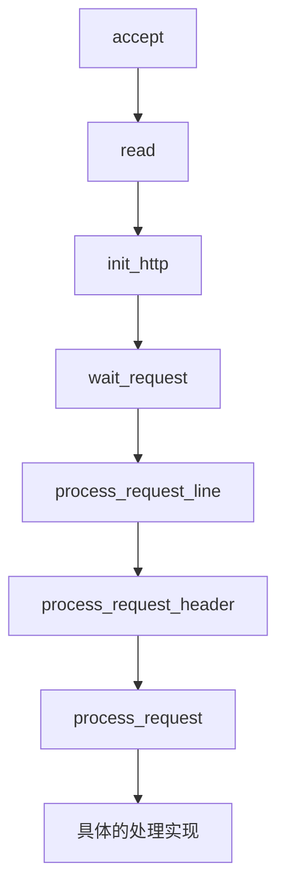

# NGINX-location的查找过程

## 1. location的接入流程

NGINX的网络请求过程,是基于事件的IO模型（NIO）.

整个流程如下：



## 2. location的查找过程


查找过程源码(核心是使用一个有序二叉树，进行的快速查找过程，以尽可能多的匹配为准)：

```
static ngx_int_t
ngx_http_core_find_location(ngx_http_request_t *r)
{
    ngx_int_t                  rc;
    ngx_http_core_loc_conf_t  *pclcf;
#if (NGX_PCRE)
    ngx_int_t                  n;
    ngx_uint_t                 noregex;
    ngx_http_core_loc_conf_t  *clcf, **clcfp;

    noregex = 0;
#endif

    pclcf = ngx_http_get_module_loc_conf(r, ngx_http_core_module);
    // 委托给 static_location 查找
    rc = ngx_http_core_find_static_location(r, pclcf->static_locations);

    if (rc == NGX_AGAIN) {

#if (NGX_PCRE)
        clcf = ngx_http_get_module_loc_conf(r, ngx_http_core_module);

        noregex = clcf->noregex;
#endif

        /* look up nested locations */
        // NGX_AGAIN, 则进行多次嵌套查找，以保证最佳匹配
        rc = ngx_http_core_find_location(r);
    }
    // 匹配成功，则返回，主要是针对'='的匹配
    if (rc == NGX_OK || rc == NGX_DONE) {
        return rc;
    }

    /* rc == NGX_DECLINED or rc == NGX_AGAIN in nested location */

#if (NGX_PCRE)

    if (noregex == 0 && pclcf->regex_locations) {
        // 正则匹配, 只要存在正则配置，那么正则匹配都会运行
        // 相比于字符匹配，正则匹配性能更差
        // 所以，当你的正则配置越多，则查找效率则必然越差，没必要配置正则就不要配了
        for (clcfp = pclcf->regex_locations; *clcfp; clcfp++) {

            ngx_log_debug1(NGX_LOG_DEBUG_HTTP, r->connection->log, 0,
                           "test location: ~ \"%V\"", &(*clcfp)->name);
            // 只要有一个正则匹配，则返回该配置
            n = ngx_http_regex_exec(r, (*clcfp)->regex, &r->uri);

            if (n == NGX_OK) {
                // 符合正则表达式，则loc_conf应用上去
                r->loc_conf = (*clcfp)->loc_conf;

                /* look up nested locations */
                // 与正常匹配相反，正则匹配是在一个匹配成功后，再进入嵌套查询
                rc = ngx_http_core_find_location(r);

                return (rc == NGX_ERROR) ? rc : NGX_OK;
            }

            if (n == NGX_DECLINED) {
                continue;
            }

            return NGX_ERROR;
        }
    }
#endif

    return rc;
}
```

非正则location 匹配查找过程

```
/*
 * NGX_OK       - exact match
 * NGX_DONE     - auto redirect
 * NGX_AGAIN    - inclusive match
 * NGX_DECLINED - no match
 */

static ngx_int_t
ngx_http_core_find_static_location(ngx_http_request_t *r,
    ngx_http_location_tree_node_t *node)
{
    u_char     *uri;
    size_t      len, n;
    ngx_int_t   rc, rv;

    len = r->uri.len;
    uri = r->uri.data;

    rv = NGX_DECLINED;

    for ( ;; ) {

        if (node == NULL) {
            // node为null时，代表匹配完成，此时将返回之前最匹配的一个 loc_conf
            return rv;
        }

        ngx_log_debug2(NGX_LOG_DEBUG_HTTP, r->connection->log, 0,
                       "test location: \"%*s\"",
                       (size_t) node->len, node->name);
        // 取小值进行比较
        n = (len <= (size_t) node->len) ? len : node->len;
        // 包含性检查
        rc = ngx_filename_cmp(uri, node->name, n);

        if (rc != 0) {
            // 二叉树查找过程, 小于0在左，大于0在右
            node = (rc < 0) ? node->left : node->right;

            continue;
        }
        // 相等的情况有两种，第1种是本次uri 长于当前配置的location
        // 第2种是本次uri 短于当前配置的location
        // 针对第1种情况，是属于一种完全匹配的
        if (len > (size_t) node->len) {

            if (node->inclusive) {

                r->loc_conf = node->inclusive->loc_conf;
                rv = NGX_AGAIN;
                // 向前迭代匹配
                node = node->tree;
                uri += n;
                len -= n;

                continue;
            }

            /* exact only */

            node = node->right;

            continue;
        }
        // 此为 uri >= location配置的情况
        if (len == (size_t) node->len) {

            if (node->exact) {
                r->loc_conf = node->exact->loc_conf;
                return NGX_OK;

            } else {
                // 包含性匹配成功
                r->loc_conf = node->inclusive->loc_conf;
                return NGX_AGAIN;
            }
        }

        /* len < node->len */
        // 以'/'结尾的配置, 比uri 多一个值
        if (len + 1 == (size_t) node->len && node->auto_redirect) {

            r->loc_conf = (node->exact) ? node->exact->loc_conf:
                                          node->inclusive->loc_conf;
            rv = NGX_DONE;
        }

        node = node->left;
    }
}
```

正则location查找

```
ngx_int_t
ngx_http_regex_exec(ngx_http_request_t *r, ngx_http_regex_t *re, ngx_str_t *s)
{
    ngx_int_t                   rc, index;
    ngx_uint_t                  i, n, len;
    ngx_http_variable_value_t  *vv;
    ngx_http_core_main_conf_t  *cmcf;

    cmcf = ngx_http_get_module_main_conf(r, ngx_http_core_module);

    if (re->ncaptures) {
        len = cmcf->ncaptures;

        if (r->captures == NULL || r->realloc_captures) {
            r->realloc_captures = 0;

            r->captures = ngx_palloc(r->pool, len * sizeof(int));
            if (r->captures == NULL) {
                return NGX_ERROR;
            }
        }

    } else {
        len = 0;
    }
    // 正则匹配, pcre_exec
    rc = ngx_regex_exec(re->regex, s, r->captures, len);
    // 无匹配返回 NGX_DECLINED
    if (rc == NGX_REGEX_NO_MATCHED) {
        return NGX_DECLINED;
    }

    if (rc < 0) {
        ngx_log_error(NGX_LOG_ALERT, r->connection->log, 0,
                      ngx_regex_exec_n " failed: %i on \"%V\" using \"%V\"",
                      rc, s, &re->name);
        return NGX_ERROR;
    }

    for (i = 0; i < re->nvariables; i++) {

        n = re->variables[i].capture;
        index = re->variables[i].index;
        vv = &r->variables[index];

        vv->len = r->captures[n + 1] - r->captures[n];
        vv->valid = 1;
        vv->no_cacheable = 0;
        vv->not_found = 0;
        vv->data = &s->data[r->captures[n]];

#if (NGX_DEBUG)
        {
        ngx_http_variable_t  *v;

        v = cmcf->variables.elts;

        ngx_log_debug2(NGX_LOG_DEBUG_HTTP, r->connection->log, 0,
                       "http regex set $%V to \"%v\"", &v[index].name, vv);
        }
#endif
    }

    r->ncaptures = rc * 2;
    r->captures_data = s->data;

    return NGX_OK;
}
```

