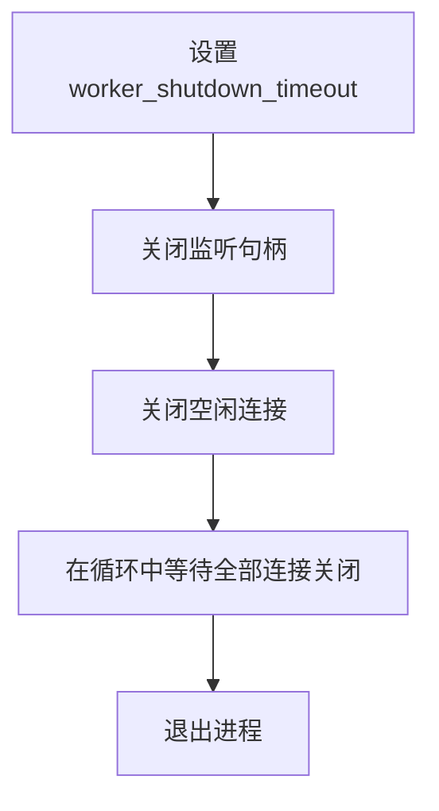

# NGINX优雅停机

## 1. 优雅停机流程

## 2. 设置worker_shutdown_timeout

配置完 worker_shutdown_timeout 之后，会加一个标志位，表示进入优雅关闭流程了。

## 3. 关闭监听句柄

要保证所在的 worker 进程不会再去处理新的连接。

## 4. 关闭空闲连接

Nginx 为了保证对资源的利用是最大化的，经常会保存一些空闲的连接，但是没有断开，这时候会首先关闭空闲连接。

## 5. 在循环中等待全部连接关闭

Nginx 不是主动的立刻关闭，是通过第一步添加的标志位，然后在循环中每当发现一个请求处理完毕，就会把这个请求使用的连接关掉，
所以在循环中等待关闭所有的时间可能会很长。当设置了 worker_shutdown_timeout 的时候，即使请求还没处理完，当时间到了之后这些请求都会被强制关闭，
也就是说优雅地关闭只完成了一半，有一部分连接是立即停止的。